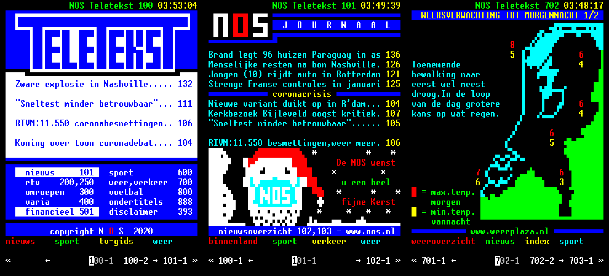

# nott

An unofficial terminal-based NOS Teletekst browser.

usage:

    nott                      → interactive mode
    nott <pagenr> [subpagenr] → render one page

dependencies: perl >= 5.20, LWP::UserAgent, and possibly Crypt::SSLeay.

Likely you will want to have a font in your terminal that can render Teletext
mosaic characters. I strongly recommend getting the amazing and free
[unscii](http://pelulamu.net/unscii/) raster font by Viznut.

The big thing that makes nott different from other existing NOS TT browsers
(including the official web-based one) is that we parse actual teletext
data (i.e. all the glorious stuff like control characters), instead of
using the buggy JSON/HTML API that other clients use.

If you have issues with font rendering, check the `nottrc` file and
change the selected character mapping. nott uses either Unicode v13
sextant chars (the default), braille chars, or unscii PUA teletext
chars.

Interactive mode keybindings:

    q         quit
    <C-o>     go back in history
    <C-i>     go forward in history
    <C-p>, k  go to previous page
    <C-n>, j  go to next page
    <C-b>, h  go to previous subpage
    <C-f>, l  go to next subpage
    !         go to the red thingy
    @         go to the green thingy
    #         go to the yellow thingy
    $         go to the cyan thingy
    0-9       enter a 3-digit page number
    H         go home (100)

keybindings and bookmarks can be customized by creating an *executable*
rc file in one of the following locations (in descending order of
precedence):

- `$HOME/.nottrc`
- `$XDG_CONFIG_HOME/nottrc (or ~/.config/nottrc)`
- `<directory where 'nott' resides>/nottrc`

See [nottrc](./nottrc) for an example.

Arrow keys and other special escaped keys (such as Fn keys) are not
supported, though support could be hacked in by abuse of the nottrc
file, if you're feeling adventurous :-)

- [chris](https://cjsmeele.nl)
